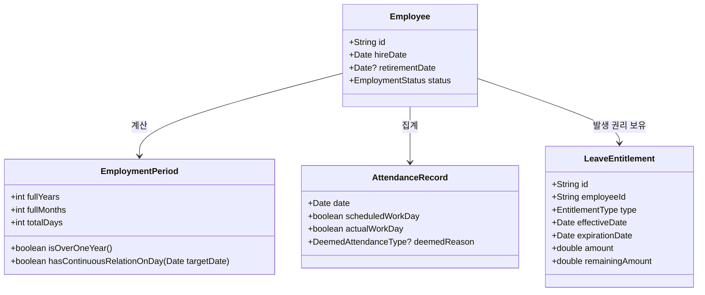

# 연차휴가 법률 도메인 모델 명세서 (Domain Model Specification)

본 문서는 **Phase 1에서 정리된 대한민국 근로기준법상 연차휴가 법적 기준**을 순수한 소프트웨어 도메인 모델(Entity, Value Object, Domain Event, Rule Interface)로 추상화한 명세서입니다.

특정 프레임워크나 특정 UI 컴포넌트에 종속되지 않으며, **노무 법률 규칙을 온전히 표현하는 독립적 도메인 계층**입니다.

---

## 1. 도메인 핵심 엔티티 & 값 객체 (Core Entities & VOs)



### 1.1. 근로자 고용 정보 (`EmployeeContext`)
법률상 연차 발생 자격을 판정하기 위한 최소 필요 고용 메타데이터:
```ts
export interface EmployeeContext {
  employeeId: string;
  hireDate: string;           // 입사일 ("YYYY-MM-DD")
  retirementDate?: string | null; // 퇴직일 ("YYYY-MM-DD" or null)
  contractEndDate?: string | null;// 계약직 계약종료일
}
```

### 1.2. 달력 기준 만 근속기간 (`EmploymentPeriod`)
단순 연도 차감이나 30.5일 나눗셈이 아닌, **실제 달력 날짜 기준 만 근속연수 및 월수**:
```ts
export interface EmploymentPeriod {
  fullYears: number;          // 만 근속연수 (예: 2025-12-31 입사, 2026-01-01 기준 = 0년)
  fullMonths: number;         // 만 근속월수 (1년 미만 월별 발생 판정용: 0 ~ 11)
  daysWorked: number;         // 총 근무일수
  isOverOneYear: boolean;     // 만 1년(365일) 초과 여부
}
```

### 1.3. 출근율 및 법정 출근 간주 (`AttendanceEvaluation`)
```ts
export type DeemedAttendanceType = 
  | 'OCCUPATIONAL_INJURY'     // 업무상 부상·질병 휴업 (산재)
  | 'MATERNITY_LEAVE'         // 출산전후휴가 및 유산·사산휴가
  | 'PARENTAL_LEAVE';         // 육아휴직 (남녀고용평등법)

export interface AttendanceEvaluation {
  periodStart: string;        // 산정 시작일 (예: 직전 1년)
  periodEnd: string;          // 산정 종료일
  totalScheduledDays: number; // 연간 소정근로일수 (주말/공휴일 제외)
  actualWorkedDays: number;   // 실제 출근일수
  deemedDays: number;         // 법정 출근 간주 일수
  attendanceRate: number;     // (actualWorkedDays + deemedDays) / totalScheduledDays
  meetsEightyPercent: boolean;// 80% 이상 충족 여부 (>= 0.8)
}
```

---

## 2. 연차 권리 발생 모델 (`LeaveEntitlement`)

법적으로 발생한 연차 권리는 **각각 고유한 유효기간과 잔여량**을 가진 독립 객체로 관리됩니다.

```ts
export type EntitlementType =
  | 'MONTHLY_UNDER_1Y'        // 1년 미만 월별 발생 (최대 11회)
  | 'ANNUAL_BASIC'            // 1년 이상 80% 출근 기본 15일
  | 'ANNUAL_SENIORITY';       // 3년 이상 근속 2년마다 가산분 (+1~10일)

export interface LeaveEntitlement {
  id: string;                 // 권리 고유 식별자 (UUID)
  employeeId: string;
  type: EntitlementType;
  
  accrualDate: string;        // 발생일 ("YYYY-MM-DD")
  expirationDate: string;     // 소멸일 ("YYYY-MM-DD")
                              // - 1년 미만분: 입사일로부터 정확히 365일째 만료
                              // - 1년 이상분: 발생일로부터 1년 후 만료
  
  amount: number;             // 발생 일수 (1.0 등)
  usedAmount: number;         // 이 권리에서 차감된 누적 사용량
  remainingAmount: number;    // amount - usedAmount
}
```

---

## 3. 법정 사용 차감 및 소멸 순서 (FIFO 원칙)

휴가 사용 시 어떤 연차부터 차감할 것인가에 대한 법적 표준 원칙:

```text
[사용자 휴가 신청: 1.5일 사용]
               │
               ▼
┌────────────────────────────────────────────────────────┐
│ 1. 유효기간이 가장 임박한 LeaveEntitlement부터 선입선출 (FIFO)  │
│    - 1년 미만 월별 연차(입사 1년 만료) 우선 차감         │
│    - 그 다음 전년도 이월분 / 당해 기본 연차 차감         │
└────────────────────────────────────────────────────────┘
               │
               ▼
[권리별 잔여량 갱신 + LeaveUsage 이벤트 생성]
```

### 3.1. 연차 소멸 이벤트 (`EntitlementExpiration`)
* 유효기간(`expirationDate`) 도래 시:
  * `remainingAmount > 0`인 잔여 일수는 시스템에 의해 일괄 소멸 처리.
  * 소멸된 수량은 사용 가능 잔여에서 영구 차감.

---

## 4. 법정 기준 vs 회사 운영 기준 대조 인터페이스 (`SettlementComparison`)

퇴직 정산 시 회계연도 기준이 입사일 기준보다 근로자에게 불리하지 않도록 대조하는 도메인 인터페이스:

```ts
export interface StatutoryVsCompanyComparison {
  employeeId: string;
  asOfDate: string;           // 산정 기준일 (퇴직일)
  
  // 1. 법정 입사일 기준 순수 누적
  statutory: {
    totalAccruedDays: number; // 입사 후 지금까지 법적으로 발생한 총 일수
    totalUsedDays: number;    // 지금까지 실제 사용한 총 일수
    statutoryRemaining: number;
  };
  
  // 2. 회사 회계연도 기준 누적
  companyFiscal: {
    totalGrantedDays: number; // 회계연도 1/1 비례 포함 부여된 총 일수
    totalUsedDays: number;    // 실제 사용한 총 일수
    fiscalRemaining: number;
  };
  
  // 3. 최종 보장 일수 (노동부 행정해석: 근로자 유리 원칙)
  finalSettlementDays: number;// Math.max(statutoryRemaining, fiscalRemaining)
  adjustmentNeeded: number;   // 회계연도 기준이 부족할 경우 추가 보상 일수
}
```

---

## 5. 법률 도메인 이벤트 (Legal Domain Events)

도메인 내부에서 상태가 전이될 때 발행되는 순수 이벤트:

1. `MonthlyLeaveAccruedEvent`: 1년 미만 근로자 1개월 개근 도래 시 연차 1일 발생
2. `AnnualLeaveAccruedEvent`: 만 1년 이상 80% 출근 달성 시 연차(15~25일) 발생
3. `LeaveUsedEvent`: 연차 사용 확정 시 FIFO 권리 차감 발생
4. `LeaveRestoredEvent`: 결재 취소 시 차감되었던 해당 Entitlement 복원
5. `EntitlementExpiredEvent`: 유효기간 만료로 인한 미사용 연차 소멸
6. `RetirementSettlementCalculatedEvent`: 퇴직 정산 비교 완료
