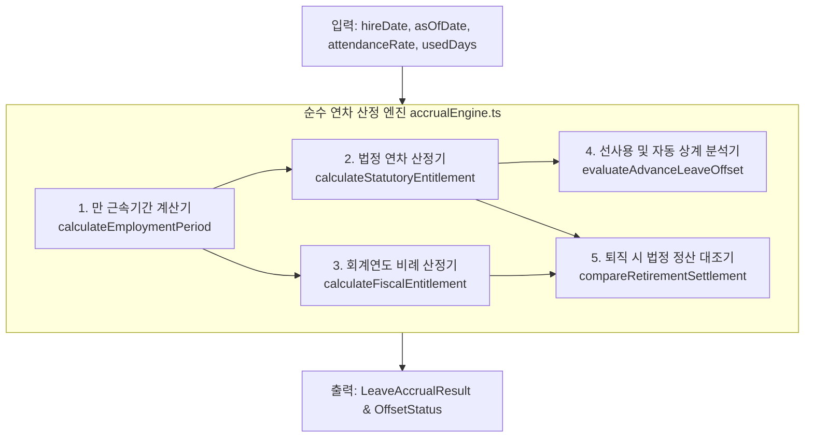

# 순수 연차 산정 엔진 설계계획서 (Pure Leave Accrual Engine Specification)

**문서 번호**: SPEC-LEAVE-003  
**대상 파일**: `src/domain/leave/accrualEngine.ts` & `src/domain/leave/accrualEngine.test.ts`  
**적용 기준**: 대한민국 근로기준법 제60조, 고용노동부 행정해석, 대법원 판례 (2021다227100)  
**참조 문서**:  
- [`docs/01_대한민국_연차휴가_법정기준_핵심요약.md`](file:///c:/WorkFit/workfit-system/workfit-gw/workfit-office/docs/01_%EB%8C%80%ED%95%9C%EB%AF%BC%EA%B5%AD_%EC%97%B0%EC%B0%A8%ED%9C%B4%EA%B0%80_%EB%B2%95%EC%A0%95%EA%B8%B0%EC%A4%80_%ED%95%B5%EC%8B%AC%EC%9A%94%EC%95%BD.md)  
- [`docs/02_연차휴가_법률_도메인_모델_명세서.md`](file:///c:/WorkFit/workfit-system/workfit-gw/workfit-office/docs/02_%EC%97%B0%EC%B0%A8%ED%9C%B4%EA%B0%80_%EB%B2%95%EB%A5%A0_%EB%8F%84%EB%A9%94%EC%9D%B8_%EB%AA%A8%EB%8D%B8_%EB%AA%85%EC%84%B8%EC%84%9C.md)  
- [`docs/연차휴가_산정_및_관리_정책_설계서.md`](file:///c:/WorkFit/workfit-system/workfit-gw/workfit-office/docs/%EC%97%B0%EC%B0%A8%ED%9C%B4%EA%B0%80_%EC%82%B0%EC%A0%95_%EB%B0%8F_%EA%B4%80%EB%A6%AC_%EC%A0%95%EC%B1%85_%EC%84%A4%EA%B3%84%EC%84%9C.md)  

---

## 1. 개요 및 설계 철학

본 엔진은 외부 I/O(데이터베이스, 네트워크, 전역 상태)에 일체 의존하지 않는 **100% 순수 함수(Pure Functions)**로 구축됩니다. 동일한 입력값(입사일, 기준일, 출근율, 사용내역)에 대해 언제나 동일하고 결정론적인(Deterministic) 법정 연차 산정 결과를 반환합니다.

### 핵심 4대 원칙
1. **단순 연도 차감(`getFullYear() - hireYear`) 및 고정 30.5일 나눗셈 절대 금지**:
   - 달력 날짜(Calendar Date)를 엄격히 대조하여 윤달, 월말(31일/말일), 12월 31일 입사자 오차를 원천 차단합니다.
2. **2020년 개정법 및 366일 대법원 판례 준수**:
   - 1년 미만 월별 발생분은 발생일로부터 1년이 아닌, **입사일로부터 만 1년(365일째 자정)에 일괄 소멸** 처리합니다.
   - 만 1년(365일) 만근 후 퇴직 시 15일 미발생 원칙(366일째 재직 상태 요구)을 판정합니다.
3. **신입사원 연차 선사용(Advance Leave) 및 자동 상계 공식 내장**:
   - 회사가 허용한 하계휴가 5일 등 입사 초기 선사용 건에 대해 음수(-) 잔여 허용 및 매월 개근 시점 자동 상계 타임라인을 제공합니다.
4. **회계연도 기준 비례연차와 퇴직 시 법정 대조 정산 엔진 제공**:
   - 회사 운영 편의를 위한 1월 1일 일괄 비례연차 계산과 퇴직 시 입사일 기준과의 유리한 조건 비교를 지원합니다.

---

## 2. 모듈 아키텍처 및 책임 구조



---

## 3. 핵심 타입 및 인터페이스 명세

```ts
/**
 * 1. 달력 기준 만 근속기간 계산 결과
 */
export interface EmploymentPeriod {
  hireDate: string;           // "YYYY-MM-DD"
  asOfDate: string;           // "YYYY-MM-DD"
  fullYears: number;          // 만 근속 연수 (예: 2025-12-31 입사, 2026-01-01 기준 = 0년)
  fullMonths: number;         // 만 근속 개월수 (0 ~ N)
  daysWorked: number;         // 총 근무일수 (D-Day)
  isOverOneYear: boolean;     // 만 1년(365일) 초과 여부
  hasRetainedOnDay366: boolean;// 366일째 근로관계 유지 여부
}

/**
 * 2. 월별 발생 연차 상세 항목 (1년 미만 신입사원)
 */
export interface MonthlyLeaveAccrualItem {
  accrualNumber: number;      // 1 ~ 11회차
  accrualDate: string;        // 발생일 ("YYYY-MM-DD", 입사일의 일자 매월 도래)
  amount: number;             // 1.0일
  expirationDate: string;     // 소멸일 (입사일로부터 만 1년이 되는 날 자정)
  isAccrued: boolean;         // 기준일(asOfDate) 현재 발생 완료 여부
  isExpired: boolean;         // 기준일 현재 유효기간 만료 여부
}

/**
 * 3. 법정 연차 산정 최종 결과
 */
export interface StatutoryLeaveResult {
  employeeId?: string;
  period: EmploymentPeriod;
  isUnderOneYear: boolean;    // 1년 미만자 여부
  
  // 발생 일수 내역
  monthlyAccruedTotal: number;// 1년 미만 월별 개근 발생 누적 (최대 11일)
  monthlyLeaveItems: MonthlyLeaveAccrualItem[]; // 11회차 상세
  annualGrantDays: number;    // 1년 이상 정기 기본/가산 연차 (15 ~ 25일, 1년 미만은 0)
  totalStatutoryGranted: number; // 현재 시점 법적으로 유효한 총 부여 일수

  // 가산 연차 정보
  seniorityYears: number;     // 근속 연수
  seniorityBonusDays: number; // 2년마다 +1일 가산 일수
}

/**
 * 4. 신입사원 선사용(Advance Leave) 및 상계 분석 결과
 */
export interface AdvanceOffsetResult {
  totalUsed: number;          // 실제 결재 승인 사용량 (예: 5.0일)
  currentAccrued: number;     // 현재까지 발생한 법정 일수 (예: 2.0일)
  balance: number;            // 현재 잔고 (currentAccrued - totalUsed, 예: -3.0일)
  isAdvanceUsed: boolean;     // 선사용 발생 여부 (totalUsed > currentAccrued)
  offsetCompletedDays: number;// 상계 완료된 일수 (예: 2.0일)
  offsetRemainingDays: number;// 향후 추가 상계되어야 할 잔여 일수 (예: 3.0일)
  estimatedFullOffsetDate: string | null; // 정상화(잔여 0일) 예상 일자 (예: "2026-11-22")
}
```

---

## 4. 세부 핵심 함수 및 알고리즘 구현 계획

### 4.1. `calculateEmploymentPeriod(hireDateStr, asOfDateStr)`
* **알고리즘**:
  1. 두 날짜를 `YYYY-MM-DD` 기준으로 파싱.
  2. 년/월/일 차이를 계산하되, `asOfDate`의 날짜(Day)가 `hireDate`의 날짜(Day)보다 작으면 `fullMonths`에서 1을 차감.
  3. 월말 예외 처리: 1월 31일 입사자의 경우 2월 28일(또는 29일) 도래 시 만 1개월로 인정.
  4. 365일 초과 여부 및 만 1년 달성 여부 플래그 세팅.

### 4.2. `calculateStatutoryEntitlement(hireDateStr, asOfDateStr, attendanceRate = 1.0)`
* **알고리즘**:
  1. `calculateEmploymentPeriod`를 호출하여 만 근속연수 및 개월수 획득.
  2. **1년 미만 근로자 (`fullYears === 0`)**:
     - 입사일로부터 매월 해당 일자가 도래할 때마다 1일씩 최대 11회차까지 리스트 생성.
     - 각 회차의 `expirationDate`는 정확히 `hireDate + 1년` 전날 자정(365일째 자정)으로 고정.
     - `asOfDate` 이전까지 도래한 회차 수를 합산하여 `monthlyAccruedTotal` 산출.
  3. **1년 이상 근로자 (`fullYears >= 1`)**:
     - 366일째 근로관계 유지 확인.
     - 출근율 80% 이상 충족 시:
       $$\text{grant} = \min\left(25, 15 + \left\lfloor \frac{\text{fullYears} - 1}{2} \right\rfloor\right)$$
     - 출근율 80% 미만인 경우: 직전 1년간 개근한 월수만큼(1개월당 1일)만 부여.

### 4.3. `evaluateAdvanceLeaveOffset(hireDateStr, asOfDateStr, usedDays)`
* **알고리즘 (홍채원 님 실사례 적용)**:
  1. 현재까지 발생한 법정 일수 $A$를 계산.
  2. 실제 사용량 $U$와의 차이 잔여금 $B = A - U$ 계산.
  3. $U > A$인 경우 (선사용 발생):
     - 상계 완료 일수: $\min(A, U)$
     - 잔여 상계 필요 일수: $U - A$
     - 완제 예상일: 입사일 기준 매월 도래일을 순회하여 누적 발생량이 $U$에 도달하는 일자 계산 (예: 2026-06-22 입사자의 5일 사용 완제일은 5회차가 도래하는 `2026-11-22`).

### 4.4. `calculateFiscalYearEntitlement(hireDateStr, targetFiscalYear)`
* **알고리즘 (회계연도 1월 1일 기준)**:
  - 전년도 중도입사자의 1월 1일 비례 연차 공식:
    $$\text{Pro-rata Grant} = 15 \times \frac{\text{전년도 재직일수}}{365}$$
  - 소수점 처리: 통상 올림 또는 반올림(취업규칙 설정값, 기본은 근로자 유리 원칙에 따라 올림 또는 0.5일 단위 올림).

---

## 5. 단위 테스트 시나리오 (`accrualEngine.test.ts`)

| 테스트 ID | 시나리오 설명 | 입력 데이터 | 기대 결과 (Expected) |
|:---:|---|---|---|
| **TEST-01** | 12/31 입사자 신정 연도 바뀜 오류 검증 | 입사: `2025-12-31`<br/>기준: `2026-01-01` | 만 근속연수: **0년** (재직 1일), 정기연차 15일 부여 불가, 발생 0일 |
| **TEST-02** | 1년 미만 신입사원 월별 1일 발생 누적 | 입사: `2026-03-15`<br/>기준: `2026-05-16` | 만 2개월 만근 ➔ 누적 발생 **2일** (3/15~4/14, 4/15~5/14) |
| **TEST-03** | 1년 미만 연차의 1년 시점 일괄 소멸 | 입사: `2025-03-01`<br/>기준: `2026-03-02` | 1년 미만 월별 연차(11일) **전량 소멸(Expired)**, 만 1년차 15일 신규 발생 |
| **TEST-04** | 만 3년 만근 가산연차 (+1일) | 입사: `2023-01-01`<br/>기준: `2026-01-02` | 만 3년 만근 ➔ 기본 15일 + 가산 1일 = **총 16일** |
| **TEST-05** | 법정 상한 한도 (25일 캡) | 입사: `2000-01-01`<br/>기준: `2026-01-02` | 만 26년 근속 ➔ $15 + 12 = 27$일이나 **25일 상한 캡 적용** |
| **TEST-06** | **홍채원 님 실사례 (선사용 5일 및 상계)** | 입사: `2026-06-22`<br/>기준: `2026-09-09`<br/>사용: `5.0일` | 발생: **2.0일**, 잔여: **-3.0일**, 선사용 5일 중 **2일 상계 완료**, **완제일: 2026-11-22** |
| **TEST-07** | 대법원 판례 (365일 퇴직 vs 366일 퇴직) | 입사: `2025-01-01`<br/>퇴직: `2025-12-31` (365일) | 15일 미발생 판정 (`hasRetainedOnDay366 === false`) |
| **TEST-08** | 회계연도 1월 1일 비례 연차 | 입사: `2025-07-01`<br/>회계연도: `2026` (184일 재직) | $15 \times (184 / 365) \approx 7.56$일 (규정상 7.6일 또는 8일 올림) |

---

## 6. 기존 시스템 연동 계획 (`useLeave.ts`)

현재 `src/features/gw/useLeave.ts`의 상단:
```ts
// AS-IS
export const ANNUAL_GRANT = 15;
```

이를 다음과 같이 교체 연동합니다:
```ts
// TO-BE
import { calculateStatutoryEntitlement, evaluateAdvanceLeaveOffset } from '@/domain/leave/accrualEngine';

// 사용자 프로필의 hireDate를 읽어 동적 법정 발생량 및 선사용 상태 도출
const statutory = calculateStatutoryEntitlement(user.hireDate, todayStr);
const offsetStatus = evaluateAdvanceLeaveOffset(user.hireDate, todayStr, usedAnnualDays);
```

이로써 기존 하드코딩 15일이 완전히 제거되고, 전사 임직원 개개인의 실제 입사일과 근속연수에 따른 살아있는 연차가 도출됩니다.
