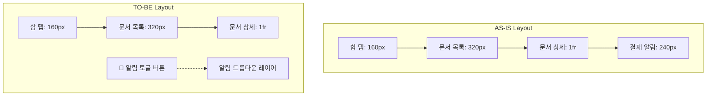

# 전자결재 메인화면 UI 개선안

본 개선안은 모니터 해상도가 낮은 소형 화면 기기에서 전자결재 메인화면의 가로 폭이 부족하여 레이아웃이 과도하게 압착되거나 깨지는 현상을 해결하기 위해 작성되었습니다.

---

## 1. 현황 및 문제점

현재 전자결재 메인 화면([ApprovalScreen.tsx](file:///c:/WorkFit/전자결재시스템/workfit-office/src/modules/gw/approval/ApprovalScreen.tsx))은 다음과 같은 **4열(4-Column) 그리드 레이아웃**을 채택하고 있어 상당한 가로 너비를 요구합니다:

```text
[좌: 함 탭 (160px)] [중: 문서목록 (320px)] [우: 문서상세 (1fr)] [최우: 결재알림 (240px)]
```

* **소형 모니터에서의 압착**: 전체 화면 가로 폭이 1280px 이하인 노트북이나 모니터 환경에서, 4개 열이 좁은 영역에 욱여넣어지며 가로 스크롤바가 생기거나 핵심 영역인 '문서 상세(1fr)'와 '문서 목록(320px)'의 텍스트가 심하게 생략·찌그러집니다.
* **낮은 정보 집중도**: 최우측의 '결재 알림' 패널은 항상 화면 한 구석을 차지하고 있으나, 사용자가 알림을 확인하는 빈도에 비해 과도한 고정 영역을 점유하고 있습니다.

---

## 2. UI/UX 개선 목표

1. **가로 공간 확보 (4열 ➡ 3열)**
   * 고정형 '결재 알림' 패널(240px)을 제거하여 가로 그리드를 `grid-cols-[160px_320px_1fr]`의 3열 구조로 변경합니다.
   * 확보된 240px의 가로 공간을 문서 상세 및 목록에 재분배하여 작은 화면에서도 쾌적한 뷰를 보장합니다.
2. **동적 알림 토글(Popover/Dropdown) 도입**
   * 우측 상단 `GwHead`의 `+ 새 상신` 버튼 바로 왼쪽에 **🔔 알림 아이콘 토글 버튼**을 배치합니다.
   * 버튼 클릭 시 레이어를 덮는 팝오버(Popover) 드롭다운을 띄워 알림 내역을 조회하게 하고, 알림 클릭 시 해당 문서로 딥링크 전환 및 팝오버가 닫히는 깔끔한 흐름을 제공합니다.
3. **직관적인 피드백 유지**
   * 읽지 않은 알림 개수를 빨간색 배지(Badge) 형태로 🔔 버튼 위에 동적으로 표시하여, 팝오버가 닫혀 있어도 실시간 확인 필요성을 인지하도록 돕습니다.

---

## 3. 상세 설계 및 인터랙션 흐름

### 📐 레이아웃 변화



### ⚡ 토글 흐름 (Interaction Sequence)
1. **기본 상태**:
   * 헤더 영역: `[ 🔔 [3] ]` `[ + 새 상신 ]`
   * 결재 알림 목록은 완전히 숨겨져 있으며 화면 그리드는 3열로 쾌적하게 렌더링됩니다.
2. **알림 클릭 시**:
   * 🔔 버튼 아래에 정교하게 정렬된 드롭다운 상자(가로 280px, 최대 높이 360px, 스크롤 가능)가 부드러운 애니메이션(`animate-fade-in` 또는 슬라이드)과 함께 출현합니다.
   * 드롭다운 바깥 영역을 클릭(Outside Click)하면 자동으로 드롭다운이 닫힙니다.
3. **알림 아이템 클릭 시**:
   * 해당 알림이 '읽음' 처리됩니다.
   * 클릭된 알림의 문서 번호/ID를 기반으로 결재함 탭 및 선택 문서(`selId`)가 변경되며 문서 상세 뷰가 갱신됩니다.
   * 인터랙션 완료 후 드롭다운은 자동으로 닫혀(Close) 사용자가 즉시 상세 문서를 읽을 수 있는 최적의 시야를 확보해 줍니다.
4. **모두 읽기 버튼**:
   * 드롭다운 헤더에 `모두 읽음` 텍스트 버튼을 두어 원클릭으로 모든 알림 배지를 리셋할 수 있게 지원합니다.

---

## 4. 기대 효과

* **A4 인쇄 레이아웃 및 짝꿍상자 호환성 극대화**: 가로폭이 넓어짐에 따라 문서 상세 탭에서 인쇄용 A4 마크업과 가로 2열 짝꿍 표가 화면 왜곡이나 잘림 없이 완벽히 렌더링됩니다.
* **인지 부하 감소**: 불필요한 시각적 노이즈(알림 리스트 상시 노출)를 숨김으로써 사용자는 결재 대기 및 결재 수행 업무에 완전히 집중할 수 있습니다.
* **모바일/태블릿 반응형 확장성 확보**: 향후 모바일 하이브리드 웹 뷰나 태블릿으로 확장 시, 3열 레이아웃을 1열 혹은 2열로 단순 변환하기 매우 용이해집니다.

---

## 5. 추가 UX 보완 아이디어 (제안)

더욱 직관적이고 완성도 높은 경험을 제공하기 위해 다음과 같은 추가 UX 요소를 함께 반영할 것을 제안합니다:

- **개별 알림 삭제(X) 버튼 지원**
   * 알림을 클릭해서 이동하는 것 외에, 읽지 않고 그냥 지우고 싶은 알림을 위해 호버 시 우측 끝에 개별 알림 삭제 버튼(X)을 제공합니다.
- **스크롤바 디자인 및 최대 높이 제한**
   * 알림이 많아질 경우 화면을 덮지 않도록 최대 높이(`max-h-[320px]`)를 고정하고, 얇고 부드러운 스크롤바 스타일(`scrollbar-thin`)을 적용하여 깔끔함을 유지합니다.
