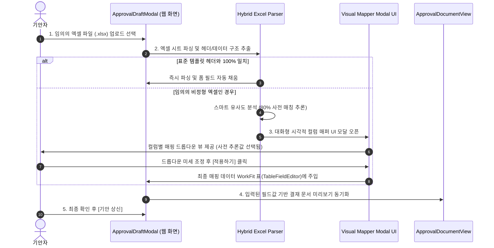

# 📊 [기능 명세서] 하이브리드(표준 규칙 + 임의 엑셀 매퍼) 엑셀 파싱 및 전자결재 연동 시스템 (WorkFit Office)

## 1. 개요 (Overview)
본 명세서는 **WorkFit Office 전자결재 시스템** 내에서:
1. **정형 표준 템플릿**: 규칙 기반(Rule-based) 3단계 자동 파싱
2. **임의의 비정형 엑셀 파일**: **스마트 자동 추론(Smart Heuristics)** + **대화형 시각적 컬럼 매퍼 UI (Interactive Visual Mapper)**

두 가지 방식을 통합 지원하여, 어떤 형태의 엑셀 파일(.xlsx)이 업로드되더라도 100% 안전하고 정합성 높게 데이터를 파싱하고 결재 폼과 바인딩하기 위한 아키텍처 및 요구사항을 정의합니다.

---

## 2. 하이브리드 엑셀 파싱 연동 구조

```mermaid
graph TD
    A[📁 사용자가 엑셀 파일 .xlsx 업로드] --> B{엑셀 파일 형태 판단}
    
    subgraph 1️⃣ 표준 템플릿 업로드 경로
        B -->|표준 헤더 일치| C1[Rule Engine 3단계 자동 파싱]
        C1 --> D1[WorkFit 입력 필드 및 표 TableFieldEditor 즉시 자동 바인딩]
    end

    subgraph 2️⃣ 임의의 비정형 엑셀 업로드 경로
        B -->|임의 엑셀 파일| C2[스마트 헤더/데이터 행 자동 감지 파서]
        C2 --> C3[유사도 분석: 금액/날짜/품명 컬럼 80% 자동 매칭 추론]
        C3 --> D2[🎛️ 대화형 시각적 컬럼 매퍼 UI 모달 노출]
        D2 -->|사용자가 드롭다운 선택 후 적용| D1
    end

    D1 --> E[📄 ApprovalDocumentView 미리보기 동기화 및 기안 상신]
```

---

## 3. 세부 기능 정의 (Detailed Requirements)

### ① 표준 템플릿 파싱 (Rule-based Fast Track)
- **주요 기능**:
  - `[📥 표준 엑셀 양식 다운로드]` 및 `[📁 엑셀 파일 업로드]` 버튼 제공.
  - **3단계 유효성 검증**:
    - **1단계**: `.xlsx`, `.xls` 확장자 및 용량 검증
    - **2단계**: 헤더(컬럼명) 일치 여부 비교
    - **3단계**: 데이터 타입/필수 값 누락 검사 (실패 시 **`[N행 M열] 금액 항목에 문자가 들어있습니다`** 오류 피드백)

### ② 임의 엑셀용 스마트 대화형 컬럼 매퍼 (Interactive Visual Mapper) ⭐
- **목적**: 기안자가 사전에 약속되지 않은 사내 비정형 엑셀 파일을 업로드하더라도, 웹 화면상에서 마우스 클릭 몇 번으로 시스템 필드와 매핑할 수 있도록 지원.
- **주요 기능**:
  - **스마트 헤더 감지 파서**: 엑셀 시트 텍스트 밀도가 높은 행을 헤더 행(Row)으로 자동 추정하고, `"단가/금액/비용"`, `"일자/날짜"`, `"품명/적요"` 텍스트 유사도를 분석하여 **80% 매칭안을 사전에 자동 선택**.
  - **시각적 매핑 모달 UI (`ExcelColumnMapperModal`)**:
    - 엑셀의 컬럼 목록(예: `A열 [품목명]`, `B열 [수량]`, `C열 [단가]`, `D열 [합계금액]`)과 WorkFit 필드를 드롭다운(Dropdown)으로 1:1 연결.
    - 예시: `WorkFit 금액 필드` ➔ `[ D열 (합계금액) ▾ ]` 선택.
  - **[적용하기]** 클릭 ➔ 파싱 결과가 `TableFieldEditor` 동적 표 및 결재 폼에 즉시 주입.

### ③ 관리자 서식 마스터 템플릿 매퍼 (Form Builder)
- 관리자가 새로운 서식 등록 시, 엑셀 템플릿의 시작 좌표(`A5`) 및 매핑 룰(`ExcelRuleMapping`)을 저장하는 UI 제공.

---

## 4. 프로세스 흐름도 (Sequence Diagram)



---

## 5. WorkFit 도메인 스키마 매핑 명세 (`schema.ts` 연동)

```typescript
// 대화형 시각적 컬럼 매퍼 데이터 구조
export interface DynamicColumnMapping {
  excelColumnIndex: string;     // 예: "A", "B", "C", "D"
  excelHeaderName: string;      // 엑셀에서 읽어온 컬럼명 (예: "합계금액")
  targetFieldKey: string;       // WorkFit 필드 키 (예: "amount", "item_name")
  dataType: 'string' | 'number' | 'date';
}

export interface ExcelParseResult {
  success: boolean;
  isStandardTemplate: boolean;
  detectedHeaders: string[];
  errors: { row: number; col: string; message: string }[];
  rows: Record<string, any>[];
  totalAmount?: number;
}
```

---

## 6. 단계별 구현 및 검증 로드맵

1. **1단계: 스마트 엑셀 파서 & 대화형 매퍼 컴포넌트 개발 (`ExcelColumnMapperModal.tsx`)**
   - SheetJS 파서 + 헤더 추론 알고리즘 + 컬럼 매핑 드롭다운 UI 개발.
2. **2단계: 독립 샌드박스 화면 테스트 (`/gw/excel-test`)**
   - 임의 엑셀 업로드 ➔ 시각적 매퍼 팝업 ➔ 드롭다운 선택 ➔ `ApprovalDraftModal` / `ApprovalDocumentView` 동기화 검증.
3. **3단계: 본 서비스 모듈 적용 (`ApprovalDraftModal.tsx` & `ApprovalFormScreen.tsx`)**
   - 전자결재 기안 모달 및 관리자 서식 관리 화면에 완전 통합.