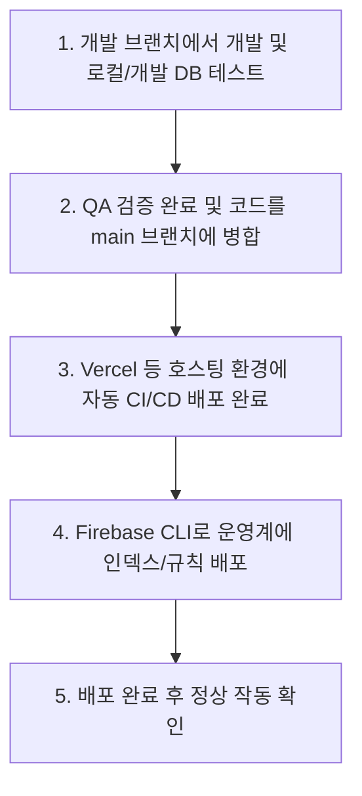

# 개발(Development) 및 운영(Production) 데이터베이스 분리 가이드

프로젝트의 안정성을 높이고 운영 데이터의 훼손을 방지하기 위해서는 개발 데이터베이스와 운영 데이터베이스를 완전히 격리하는 것이 필수적입니다. 이 문서에서는 현재 Firebase와 Vite(React) 기반으로 설계된 이 프로젝트에서 두 환경을 가장 효과적으로 분리하는 아키텍처와 구체적인 적용 방법을 설명합니다.

---

## 1. 분리 모델 선택 (아키텍처 설계)

Firebase 환경에서는 크게 두 가지 방법으로 데이터베이스를 분리할 수 있습니다.

### 방법 A. 프로젝트 단위의 완전 분리 (강력 권장)
* **개념:** `workfit-office-dev`(개발용)와 `workfit-office-prod`(운영용)라는 두 개의 독립된 Firebase 프로젝트를 생성하는 방식입니다.
* **장점:** 
  * 데이터, 보안 규칙, 유저 인증 정보, 스토리지 파일이 완벽히 격리됩니다.
  * 실수로 운영계 API를 조회하거나 데이터를 조작할 위험이 0%에 수렴합니다.
  * 무료 등급(Spark 요금제)을 환경별로 적용받을 수 있습니다.
* **단점:** 초기 Firebase 콘솔에서의 리소스 설정(Firestore 활성화, 스토리지 활성화 등)을 두 번씩 수행해야 합니다.

### 방법 B. 동일 프로젝트 내 Named Database 활용 (선택)
* **개념:** 단일 Firebase 프로젝트 내에 두 개 이상의 Firestore 데이터베이스(`(default)` 및 `dev-db`)를 생성하는 방식입니다. (현재 [firebase.ts](file:///c:/WorkFit/%EC%A0%84%EC%9E%90%EA%B2%B0%EC%9E%AC%EC%8B%9C%EC%8A%A4%ED%85%9C/workfit-office/src/shared/lib/firebase.ts) 및 `.env.local`에 `VITE_FB_FIRESTORE_DB_ID`가 준비되어 있는 원리)
* **장점:** 하나의 Firebase 프로젝트 내에서 편리하게 관리할 수 있습니다.
* **단점:** 
  * Firebase Auth(로그인 계정)와 Storage(인감, 프로필 사진 등)는 프로젝트 내에서 데이터베이스별로 나뉘지 않고 공유되므로 완전히 독립적인 테스트가 불가능합니다.
  * 환경 설정 실수가 운영계 데이터 오염으로 이어질 가능성이 있습니다.

> [!IMPORTANT]
> **결론:** 안정적인 배포와 운영을 위해 **방법 A (프로젝트 단위의 완전 분리)** 방식을 가장 권장합니다. 아래 가이드는 방법 A를 기준으로 작성되었습니다.

---

## 2. 세부 구축 절차

### 단계 1: Firebase 프로젝트 이원화 생성
1. [Firebase Console](https://console.firebase.google.com/)에 접속합니다.
2. 개발용 프로젝트(예: `workfit-office-dev`)와 운영용 프로젝트(예: `workfit-office-prod`)를 각각 생성합니다.
3. 각 프로젝트 내에서 **Firestore Database** 및 **Storage** 서비스를 시작(활성화)합니다.
4. 각 프로젝트 설정에서 **웹 앱(Web App)**을 등록하고 각각의 SDK 설정값(config)을 획득합니다.

---

### 단계 2: Vite 환경 변수 파일 구성 (`.env.*`)
Vite는 실행 모드(`development` 또는 `production`)에 따라 환경 변수 파일을 다르게 읽어옵니다. 이를 활용하여 코드 변경 없이 연결할 데이터베이스를 다이내믹하게 스위칭합니다.

#### 1) 로컬 개발 및 테스트 환경용 (`.env.development`)
로컬에서 `npm run dev` 실행 시 로드되는 환경입니다. 개발용 Firebase 프로젝트 설정을 입력합니다.
```env
VITE_FB_API_KEY="개발용_API_KEY"
VITE_FB_AUTH_DOMAIN="workfit-office-dev.firebaseapp.com"
VITE_FB_PROJECT_ID="workfit-office-dev"
VITE_FB_APP_ID="1:xxxx:web:xxxx"
VITE_FB_STORAGE_BUCKET="workfit-office-dev.firebasestorage.app"
VITE_FB_MESSAGING_SENDER_ID="개발용_SENDER_ID"
VITE_FB_FIRESTORE_DB_ID="" # default 데이터베이스 사용 시 공백

VITE_AUTH_ENABLED="true"
```

#### 2) 최종 배포 및 운영 환경용 (`.env.production`)
빌드(`npm run build`) 후 프로덕션 환경에 배포될 때 주입할 값입니다. 운영용 Firebase 프로젝트 설정을 입력합니다.
*(주의: 이 파일은 원격 저장소에 커밋되어 관리되거나, CI/CD 플랫폼의 빌드 환경변수로 주입되는 방식으로 사용할 수 있습니다.)*
```env
VITE_FB_API_KEY="운영용_API_KEY"
VITE_FB_AUTH_DOMAIN="workfit-office-prod.firebaseapp.com"
VITE_FB_PROJECT_ID="workfit-office-prod"
VITE_FB_APP_ID="1:yyyy:web:yyyy"
VITE_FB_STORAGE_BUCKET="workfit-office-prod.firebasestorage.app"
VITE_FB_MESSAGING_SENDER_ID="운영용_SENDER_ID"
VITE_FB_FIRESTORE_DB_ID=""

VITE_AUTH_ENABLED="true"
```

#### 3) 로컬 비밀값 보존용 (`.env.local`)
개발자 개인 PC 환경에서만 비밀 값이나 임시 재정의 값이 필요할 때 사용합니다. 이 파일은 `.gitignore`에 등록되어 있어 git에 공유되지 않습니다.

---

### 단계 3: Firebase CLI 멀티 프로젝트 바인딩
Firebase CLI 도구(룰 배포, 함수 배포 등)를 실행할 때도 환경이 나뉘어야 합니다. [.firebaserc](file:///c:/WorkFit/%EC%A0%84%EC%9E%90%EA%B2%B0%EC%9E%AC%EC%8B%9C%EC%8A%A4%ED%85%9C/workfit-office/.firebaserc) 파일을 이용해 다중 프로젝트 에일리어스(Alias)를 지정합니다.

프로젝트 루트의 `.firebaserc` 파일을 다음과 같이 변경합니다:
```json
{
  "projects": {
    "default": "workfit-office-dev",
    "development": "workfit-office-dev",
    "production": "workfit-office-prod"
  }
}
```

이 상태에서 룰이나 인덱스를 개별 배포할 때 다음과 같이 대상을 지정합니다:
```bash
# 개발 서버에 룰/인덱스 배포
firebase use development
firebase deploy --only firestore:rules

# 운영 서버에 룰/인덱스 배포
firebase use production
firebase deploy --only firestore:rules
```

---

### 단계 4: 시딩(Seed) 스크립트 격리
현재 [seed-firestore.ts](file:///c:/WorkFit/%EC%A0%84%EC%9E%90%EA%B2%B0%EC%9E%AC%EC%8B%9C%EC%8A%A4%ED%85%9C/workfit-office/scripts/seed-firestore.ts) 스크립트는 로컬의 `serviceAccount.json`을 사용하여 적재를 진행합니다.
실수로 운영 디비에 개발 데이터가 덮어씌워지는 대형 사고를 방지하기 위해 다음과 같은 조치를 취해야 합니다.

1. **서비스 어카운트 키 분리:** 
   * 개발용: `serviceAccount-dev.json`
   * 운영용: `serviceAccount-prod.json` (이 키 파일은 절대로 로컬이나 Git에 노출하지 않고, 어드민 권한자의 보안 환경에서만 실행해야 합니다.)
2. **시드 스크립트 실행 제약 조건 추가:**
   * 시드 스크립트가 실행될 때 현재 타깃 프로젝트 ID가 개발용(`workfit-office-dev`)인지 검증하고, 만약 프로덕션 서버인 경우 사용자의 명시적인 키보드 입력(Y/N) 또는 추가 아규먼트(`--prod-confirm`)를 받지 않으면 프로세스를 강제 종료(abort)시키는 방어 코드를 적용합니다.

---

### 단계 5: Vercel / Netlify 등 호스팅 플랫폼 배포 환경변수 설정
어플리케이션을 Vercel 등 외부 호스팅 서버에 올려 배포할 때는 빌드 과정에서 빌드 환경 변수로 주입합니다.
* **Vercel 설정:** `Project Settings` -> `Environment Variables`에 위 `VITE_FB_*` 변수들을 `Production` 환경(운영 데이터베이스 정보)과 `Preview / Development` 환경(개발 데이터베이스 정보)으로 분리하여 등록해 줍니다.
* 빌드 도구는 빌드 시 타깃 환경(Production 등)에 맞춰 알아서 환경변수를 스왑해 주므로, 코드 변경 없이 완전 분리된 배포가 가능해집니다.

---

## 3. Vite 실행 모드(Mode) 전환 가이드

Vite는 환경 파일(`.env.development`, `.env.production`)을 해석할 때 **실행 모드**에 따라 적절한 파일을 자동으로 스왑하여 읽어옵니다.

### 1) 기본 모드 동작 방식
* **`npm run dev`** (로컬 개발): 기본값으로 **`development`** 모드로 실행되며, 자동으로 `.env.development` 설정을 로드합니다.
* **`npm run build`** (운영 빌드): 기본값으로 **`production`** 모드로 실행되며, 자동으로 `.env.production` 설정을 로드합니다.

### 2) 명시적으로 모드를 전환하는 명령어 플래그
특정한 필요에 의해 기본 모드를 재정의하고 싶다면 `--mode` 플래그를 추가로 지정합니다.

* **로컬에서 운영계 데이터를 붙여 임시 디버깅하고 싶을 때:**
  ```bash
  npx vite --mode production
  ```
* **빌드 결과물에 개발용 데이터베이스 정보를 내장하여 빌드하고 싶을 때:**
  ```bash
  npx vite build --mode development
  ```

### 3) package.json 스크립트 구성 예시
실무에서는 명령어를 매번 타이핑하지 않고 `package.json`의 `scripts`에 등록해 관리하는 것을 추천합니다.
```json
"scripts": {
  "dev": "vite",                              // 로컬 개발 환경 실행
  "dev:prod": "vite --mode production",        // 로컬에서 운영 데이터베이스 연결 실행
  "build": "tsc --noEmit && vite build",      // 운영계용 빌드
  "build:dev": "vite build --mode development" // 개발계용 빌드
}
```

---

## 4. 데이터베이스 변경점 동기화 전략 (Schema-less NoSQL)

관계형 데이터베이스(RDB)와 달리, Firestore(NoSQL)는 데이터베이스 자체에 `ALTER TABLE` 명령어가 없습니다. 따라서 변경 사항은 데이터베이스 자체가 아닌 **보안 규칙, 인덱스 파일, 프론트엔드 코드**를 통해 관리하고 배포합니다.

### 1) 스키마 구조 변경 (Zod 등 코드 변경)
* **전략:** 개발 브랜치에서 코드를 짜면서 Zod 스키마 파일(`schema.ts`)의 속성을 추가/수정합니다.
* **배포:** 이 수정 코드가 `main` 브랜치에 Merge 및 배포되면 운영 서버의 클라이언트 코드에 자동으로 반영됩니다.

### 2) 인덱스 및 보안 규칙 파일 동기화
* **전략:** 개발 중 생성된 Firestore 인덱스 및 규칙 파일(`firestore.rules`, `firestore.indexes.json`)을 원격 저장소에 버전 관리(Git)합니다.
* **배포:** Firebase CLI를 이용하여 대상 환경(development 또는 production)을 스위칭하고 전송합니다.
  ```bash
  # 인덱스 및 룰 배포 (프로덕션 환경 대상)
  firebase use production
  firebase deploy --only firestore:rules,firestore:indexes
  ```

### 3) 데이터 마이그레이션 및 동기화 (복제 금지 원칙)
개발 환경의 더미 데이터가 섞여 들어가는 문제를 방지하기 위해 **개발용 DB 레코드를 그대로 운영용 DB에 복제하는 일은 절대 금지**합니다.
대신, 다음 전략으로 데이터를 변경하고 동기화합니다.

* **기초 데이터(공통코드, 양식 등):** seed 스크립트에 안전하게 코드화하고, 필요시 개발 및 운영 서버 각각에서 독립적으로 스크립트를 돌려 동기화합니다.
* **기존 문서 마이그레이션:** 스키마 필드가 변경되어 기존 운영 문서들도 새 규격에 맞춰야 할 경우:
  * **코드 단 방어 조치:** 프론트엔드 파서 단계에서 기본값을 fallback 처리하여 ZodError가 발생하지 않도록 대응합니다. (예: `status: data.status ?? '사용'`)
  * **마이그레이션 스크립트:** 부득이하게 물리 데이터 수정이 필요한 경우 Firebase Admin SDK를 이용해 운영 데이터베이스 내부의 문서들만 일괄 필드 갱신을 진행하는 1회성 마이그레이션 스크립트를 개발해 실행합니다.

---

## 5. 최종 배포 시나리오 (Workflow)

기능 개발 완료 후 운영 서버에 반영하는 일련의 순서는 다음과 같이 진행됩니다.



1. **개발 및 로컬 테스트:** 개발 서버(`npm run dev`)에서 개발용 Firestore 데이터베이스와 연결해 개발을 진행합니다.
2. **코드 병합 및 배포:** 개발이 모두 완료되고 안정성이 확인되면 코드를 `main` 브랜치에 병합하여 호스팅 플랫폼(Vercel 등)을 통해 배포합니다. (Vercel 환경변수로 설정된 `env.production` 정보 주입)
3. **Firestore 규칙 및 인덱스 배포:** 로컬 터미널에서 `firebase use production` 명령으로 대상을 설정하고, 보안 규칙과 인덱스 배포(`firebase deploy --only firestore:rules,firestore:indexes`)를 수행합니다.
4. **마스터 데이터 동기화 (선택):** 신규 카테고리나 코드 등이 새로 생긴 경우, 배포용 환경변수가 설정된 별도의 격리된 환경에서 `npm run seed` 등의 시드 주입기를 구동하여 기초 데이터를 동기화합니다. (기존 운영 데이터 유지 필수)
5. **모니터링:** 운영 서비스에서 404/ZodError 등이 발생하지 않는지 실시간 모니터링합니다.
