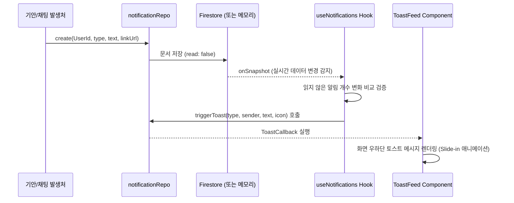

# 🔔 실시간 알림 및 웹 푸시(Web Push) 시스템 분석 및 구현 구상안

본 문서는 현재 WorkFit 시스템의 알림 메커니즘을 분석하고, 이를 기반으로 **통합 알림 센터(GNB)** 및 **웹 푸시(FCM & Service Worker) 알림**을 유기적으로 결합하여 구현하기 위한 상세 구상안입니다.

---

## 🔍 1. 현재 알림 시스템 구성 및 작동원리 분석

현재 WorkFit 프로젝트에는 실시간 토스트 알림과 데이터 구독(Subscription)을 위한 기본적인 뼈대가 구현되어 있습니다.

### 1.1 데이터 모델 및 스키마
*   **스키마 (`LiveNotification`)**: [liveNotification/schema.ts](file:///c:/WorkFit/전자결재시스템/workfit-office/src/domain/liveNotification/schema.ts)
    *   `id`: 알림 식별자 (`NT-0001` 채번 또는 Firestore ID)
    *   `userId`: 수신자 사원 ID
    *   `type`: 알림 분류 (`'결재'`, `'메신저'`, `'공지'`)
    *   `title` / `text`: 알림 제목 및 본문 요약
    *   `senderName`: 발신자 이름
    *   `linkUrl`: 클릭 시 이동할 딥링크(Deep Link) 주소
    *   `read`: 읽음 여부 (`boolean`)
    *   `createdAt`: 생성 일시 (ISO Local String)

### 1.2 실시간 데이터 연동 및 구독 (Data Layer)
*   **리포지토리 (`notificationRepo`)**: [notification.repo.ts](file:///c:/WorkFit/전자결재시스템/workfit-office/src/data/notification/notification.repo.ts)
    *   **Firebase 연동 활성화 시**: Firestore의 `onSnapshot` API를 활용하여 웹소켓 연결 없이도 실시간으로 `notifications` 컬렉션의 변화를 감지하고 동기화합니다.
    *   **로컬 데모 모드 시**: 메모리 배열 (`memory`)과 `Set<() => void>` 기반의 옵저버 패턴(`listeners`)을 활용해 브라우저 내에서 실시간 알림 트리거 및 구독을 모방합니다.

### 1.3 화면단 토스트(Toast) 알림 표출 흐름 (UI Layer)
*   **알림 감지 Hook (`useNotifications`)**: [useNotifications.ts](file:///c:/WorkFit/전자결재시스템/workfit-office/src/features/notification/useNotifications.ts)
    *   로그인한 사용자의 알림 데이터 리스트를 실시간 구독합니다.
    *   이전 카운트와 비교하여 **새로운 읽지 않은 알림이 가산되었을 때**, 가장 최신의 알림 객체를 추출해 공통 이벤트 버스인 `triggerToast()`를 호출합니다.
*   **토스트 피드 UI (`ToastFeed`)**: [ToastFeed.tsx](file:///c:/WorkFit/전자결재시스템/workfit-office/src/app/shell/ToastFeed.tsx)
    *   `registerToastListener`를 통해 `triggerToast` 이벤트를 리스닝하고 있습니다.
    *   새 알림 이벤트가 도착하면 화면 우측 하단에 CSS Keyframe 애니메이션(`toast-in`)을 적용한 토스트 메시지를 4.2초간 동적으로 노출합니다.



---

## 💡 2. GNB 통합 알림 센터(종 모양) 구현 구상안

사용자가 어느 페이지에서든 본인에게 온 업무(결재, 메시지)를 즉시 확인하고 해당 화면으로 이동할 수 있도록 공통 GNB에 통합 알림 센터를 구현합니다.

### A. UI/UX 디자인 및 레이아웃
1.  **GNB 알림 아이콘 (종 모양)**
    *   [Topbar.tsx](file:///c:/WorkFit/전자결재시스템/workfit-office/src/app/shell/Topbar.tsx) 우측 사용자 프로필 좌측 영역에 배치합니다.
    *   읽지 않은 알림이 있을 시 붉은색 원형 배지(Badge) 및 미독 개수(99+)를 표기합니다.
2.  **알림 드롭다운 팝오버 (Popover)**
    *   종 모양 아이콘 클릭 시 아래로 열리는 오버레이 창을 구성합니다.
    *   **헤더**: "알림 센터" 타이틀 및 `[모두 읽음 처리]` 액션 버튼 제공.
    *   **리스트**: 최근 알림 5~10개를 시간 역순으로 정렬하여 표시.
        *   결재 관련 알림: 🖋️ 아이콘과 함께 보라색 포인트 적용.
        *   메신저 관련 알림: 💬 아이콘과 함께 베이지색 포인트 적용.
    *   **동작**:
        *   개별 알림 클릭 시 `useMarkNotificationRead` 뮤테이션을 실행해 해당 알림을 읽음 처리하고, `linkUrl`(예: `/gw/approval?doc=docNo`)이 있을 경우 해당 라우터로 페이지를 이동(딥링크)시킵니다.

### B. 실시간 토스트(Toast) 알림의 필요성 및 하이브리드 분담 전략
화면 내 실시간 팝업인 토스트 알림의 필요성을 다각도로 검증하고, 백그라운드 푸시와 역할을 분담하는 하이브리드 전략을 제시합니다.

#### 1. 토스트 알림을 유지/제외할 때의 비교
*   **유지 시 장점**: 메신저(채팅)와 같이 실시간성이 매우 높은 업무 대화 시, 사용자가 작업 중에도 시선 분산 없이 즉시 대화가 도달했음을 인지할 수 있습니다. (사용자 작업 영역인 화면 하단/우하단 노출)
*   **제외 시 장점**: 복잡한 작업(품의 작성, 데이터 입력 등) 수행 시 잦은 팝업 노출로 인한 작업 집중 방해(피로감)를 완전히 배제할 수 있습니다.
*   **제외 시 단점**: 사용자가 GNB 종 모양 배지의 빨간 숫자 변화만 관찰해야 하므로, 실시간 대화에 대한 반응 속도가 급격히 느려집니다.

#### 2. 하이브리드 알림 역할 분담안
사용자의 브라우저 활성화 여부에 따라 알림 채널을 이원화합니다.

| 사용자 기기 상태 | 알림 채널 | 세부 동작 방식 |
| :--- | :--- | :--- |
| **포그라운드** (사이트 작업 중) | **GNB 배지 + 토스트 알림** | OS 푸시 팝업을 차단하여 불필요한 OS 알림 피로를 막고, 인앱 토스트로 자연스럽게 노출합니다. 단, **실시간 메신저(채팅) 알림**에 우선적으로 적용하고 정기 결재 등은 팝업 없이 배지만 갱신합니다. |
| **백그라운드** (다른 탭/브라우저 종료) | **OS 브라우저 웹 푸시** | 서비스 워커가 백그라운드에서 신호를 가로채 OS 시스템 알림 창에 띄움으로써 인트라넷이 꺼져있을 때도 업무 누락을 막습니다. |

---

## 🚀 3. 브라우저 웹 푸시(Web Push) 도입 및 FCM 연동 구상안

웹사이트를 닫아 두거나 백그라운드 상태에 있을 때도 실시간 업무 누락을 막기 위해 **Firebase Cloud Messaging(FCM)**과 **Service Worker** 기반의 웹 푸시 알림을 결합합니다.

### 3.1 서비스 워커 구현 (`public/firebase-messaging-sw.js`)
*   웹브라우저 백그라운드에서 백그라운드 메시지 수신을 처리하기 위해 서비스 워커 파일을 구성합니다.
*   *참고: Vite 빌드 환경의 경우, 프로젝트 루트에 `/public` 폴더가 없다면 폴더를 신규 생성한 뒤 이 안에 위치시켜야 브라우저 루트 경로(`/firebase-messaging-sw.js`)로 올바르게 서비스될 수 있습니다.*

```javascript
// public/firebase-messaging-sw.js
importScripts('https://www.gstatic.com/firebasejs/10.14.0/firebase-app-compat.js');
importScripts('https://www.gstatic.com/firebasejs/10.14.0/firebase-messaging-compat.js');

firebase.initializeApp({
  apiKey: "YOUR_API_KEY",
  authDomain: "YOUR_AUTH_DOMAIN",
  projectId: "YOUR_PROJECT_ID",
  storageBucket: "YOUR_STORAGE_BUCKET",
  messagingSenderId: "YOUR_MESSAGING_SENDER_ID",
  appId: "YOUR_APP_ID"
});

const messaging = firebase.messaging();

// 백그라운드 알림 수신 및 시스템 알림 생성
messaging.onBackgroundMessage((payload) => {
  const notificationTitle = payload.notification.title;
  const notificationOptions = {
    body: payload.notification.body,
    icon: '/logo.png', // 앱 로고 이미지
    data: { url: payload.data?.linkUrl } // 클릭 시 이동할 URL
  };

  self.registration.showNotification(notificationTitle, notificationOptions);
});

// OS 알림 클릭 시 해당 딥링크로 탭 전환 및 활성화
self.addEventListener('notificationclick', (event) => {
  event.notification.close();
  const targetUrl = event.notification.data?.url || '/';

  event.waitUntil(
    clients.matchAll({ type: 'window', includeUncontrolled: true }).then((windowClients) => {
      // 이미 열려있는 동일 도메인 탭이 있다면 포커스
      for (let i = 0; i < windowClients.length; i++) {
        const client = windowClients[i];
        if (client.url.includes(targetUrl) && 'focus' in client) {
          return client.focus();
        }
      }
      // 없으면 새 창으로 열기
      if (clients.openWindow) {
        return clients.openWindow(targetUrl);
      }
    })
  );
});
```

### 3.2 FCM 토큰 등록 및 포그라운드 수신 연동
1.  **알림 권한 요청 및 VAPID 키 설정**:
    *   로그인 시 브라우저 알림 권한(`Notification.requestPermission()`)을 승인받습니다.
    *   브라우저가 보안 구독 엔드포인트를 식별하도록 Firebase FCM SDK에 **VAPID Key(애플리케이션 서버 키)**를 전달하여 토큰을 발급받아야 웹 푸시 표준 프로토콜이 작동합니다.
    *   `getToken(messaging, { vapidKey: 'YOUR_PUBLIC_VAPID_KEY' })`
2.  **FCM 토큰 발급 및 저장**:
    *   발급된 고유 토큰 값을 사용자 DB의 `users.fcmTokens` 배열 형태에 매핑하여 저장합니다.
3.  **포그라운드 실시간 연동 (`onMessage`)**:
    *   사용자가 사이트를 보고 있을 때는 브라우저 OS 알림 창이 덮어씌워지는 대신, 앱 내부의 **토스트 이벤트 버스로 우회**시킴으로써 중복 알림을 방지하고 깔끔한 UX를 제공합니다.
    ```typescript
    import { onMessage } from 'firebase/messaging';
    import { triggerToast } from '@/features/notification/useNotifications';

    // 포그라운드 메시지 수신 리스너
    onMessage(messaging, (payload) => {
      if (payload.notification) {
        const icon = payload.data?.type === '결재' ? '🖋️' : '💬';
        const color = payload.data?.type === '결재' ? '#6c5ce7' : '#16b8cf';
        
        // 브라우저 팝업 대신 인앱 토스트 팝업 강제 실행
        triggerToast(
          payload.data?.type || '공지',
          payload.notification.title || '알림',
          payload.notification.body || '',
          icon,
          color
        );
      }
    });
    ```

### 3.3 백엔드/리포지토리 발송 로직 추가
*   `notificationRepo.create()` 메서드 실행 시, DB에 적재된 타겟 수신자의 `fcmTokens`를 조회합니다.
*   FCM 발송 서버 API를 연동하여 푸시 페이로드(Payload)를 전달합니다.
    *   **페이로드 예시**:
        ```json
        {
          "message": {
            "token": "USER_DEVICE_FCM_TOKEN",
            "notification": {
              "title": "🖋️ 결재 요청",
              "body": "홍길동 팀원이 '휴가 신청서' 결재를 요청했습니다."
            },
            "data": {
              "type": "결재",
              "linkUrl": "/gw/approval?doc=AP-260716-0001"
            }
          }
        }
        ```

---

## 📈 4. 단계별 구현 및 통합 로드맵

1.  **Phase 1 (GNB 통합 알림 센터)**
    *   GNB `Topbar.tsx` 내 종 아이콘 배치 및 드롭다운 팝오버 개발.
    *   읽음 처리 연동 및 클릭 시 전자결재/메신저 라우팅 딥링크 구현.
    *   [AppShell.tsx](file:///c:/WorkFit/전자결재시스템/workfit-office/src/app/shell/AppShell.tsx) 하단 주석 처리된 `ToastFeed` 컴포넌트 복원 및 정상 작동 재검증.
2.  **Phase 2 (웹 푸시 알림 인프라 구축)**
    *   `/public` 폴더 신설 및 `public/firebase-messaging-sw.js` 서비스 워커 파일 배치.
    *   로그인 시 VAPID Key 기반 FCM 토큰 발급 프로세스 추가 및 `users` 컬렉션 연동 적재.
    *   `onMessage` 포그라운드 이벤트를 구독하여 인앱 토스트(`triggerToast`)와 실시간 연동.
    *   알림 생성 리포지토리 메서드 내 FCM Push 발송 API 연동 추가.

---

## 🛠️ 5. FCM VAPID 키 및 Server Key 발급 & 환경변수 설정 가이드

실제 브라우저 웹 푸시(Web Push) 작동을 위해 Firebase 콘솔에서 인증 키를 발급받고 환경변수 파일(`.env.local` 또는 `.env`)에 등록하는 방법입니다.

### 5.1 VAPID Public Key (웹 푸시 인증 키) 발급
VAPID(Voluntary Application Server Identification) 키는 브라우저가 파이어베이스 푸시 서비스와 안전하게 통신하도록 검증하는 공개 키 쌍입니다.
1. **Firebase 콘솔**(https://console.firebase.google.com/) 접속 및 프로젝트 선택.
2. 좌측 상단 톱니바퀴 아이콘 ⚙️ 클릭 ➔ **프로젝트 설정** 클릭.
3. 상단 탭 중 **클라우드 메시징(Cloud Messaging)** 탭 선택.
4. 아래로 스크롤하여 **웹 구성(Web configuration)** 섹션 확인.
5. **웹 푸시 인증서(Web Push certificates)**의 `인증서 키 쌍 발급(Generate Key Pair)` 버튼을 클릭하여 VAPID 키를 생성합니다.

6. 생성된 긴 공개 키 문자열(VAPID Public Key)을 복사합니다.

### 5.2 FCM Legacy Server Key (발송용 서버 키) 확인
본 프로젝트는 순수 클라이언트 기반 프로토콜 연동을 위해 FCM 레거시 HTTP 전송 프로토콜을 사용하므로 서버 키가 필요합니다.
1. 동일한 **클라우드 메시징** 설정 페이지에서 **Firebase Cloud Messaging API(V1)** 아래에 있는 **Cloud Messaging API(레거시)** 항목 확인.
2. 기본값으로 `사용 중지됨`으로 되어있다면, 우측 점 3개 버튼을 클릭하여 **Google Cloud Console에서 관리**로 이동한 뒤 **사용(Enable)** 버튼을 클릭합니다.
3. 활성화 후 Firebase 콘솔로 돌아와 새로고침하면 **서버 키(Server Key)** 필드에 발송 인증을 위한 긴 문자열 키가 생성됩니다. 이 값을 복사합니다.

### 5.3 로컬 환경변수 파일 설정
프로젝트 루트 디렉토리에 `.env.local` 파일을 생성(혹은 기존 파일 수정)하고 다음 정보를 추가합니다.

```env
# Firebase 클라이언트 기본 설정
VITE_FB_API_KEY=YOUR_API_KEY
VITE_FB_AUTH_DOMAIN=YOUR_AUTH_DOMAIN
VITE_FB_PROJECT_ID=YOUR_PROJECT_ID
VITE_FB_APP_ID=YOUR_APP_ID
VITE_FB_STORAGE_BUCKET=YOUR_STORAGE_BUCKET
VITE_FB_MESSAGING_SENDER_ID=YOUR_MESSAGING_SENDER_ID

# FCM 웹 푸시를 위한 VAPID 공개 키 (5.1에서 생성한 값)
VITE_VAPID_KEY=BG...YOUR_PUBLIC_VAPID_KEY...

# client-to-client 푸시 발송을 위한 레거시 FCM 서버 키 (5.2에서 생성한 값)
VITE_FCM_SERVER_KEY=AIzaSy...YOUR_FCM_SERVER_KEY...
```

> [!CAUTION]
> **보안 주의**
> `VITE_FCM_SERVER_KEY`는 클라이언트 코드가 발송 트리거를 수행하기 위해 환경변수에 기재되는 값입니다. 실제 운영 서비스에서는 이 서버 키가 클라이언트에 노출되면 제3자가 푸시를 임의 발송할 우려가 있으므로, 실제 운영 빌드 전에는 Firebase Cloud Functions 등의 백엔드 전송 서버로 이전하고 클라이언트 측 변수에서는 제외할 것을 적극 권장합니다.