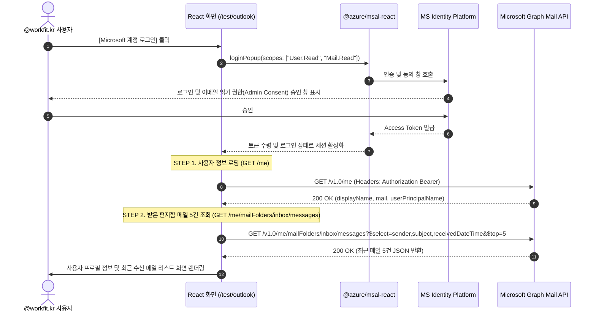

# Microsoft 365 Outlook 메일 조회 PoC 설계서

---

## 1. 개요 (Introduction)

### 1.1 목적 (Objectives)
* 사용자의 회사 이메일(@workfit.kr) 계정을 Microsoft Identity Platform(Entra ID) 및 Microsoft Graph API와 연동하여 Outlook 받은 편지함의 수신 이메일 목록을 조회할 수 있는지 기술적 가능 여부를 검증함.

### 1.2 성공 기준 (Acceptance Criteria)
1. **인증 성공**: 사내 계정(@workfit.kr)을 통해 MS 로그인 및 억세스 토큰 취득이 성공적으로 처리되는가?
2. **프로필 조회 성공**: `GET /me` 호출 시 사용자의 이름, 이메일 주소를 정상 반환받는가?
3. **메일 조회 성공**: `GET /me/mailFolders/inbox/messages` 호출 시 받은 편지함의 최근 5건 데이터가 테이블 화면에 올바르게 출력되는가?

---

## 2. 사전 준비 사항 (Prerequisites)

개발 및 테스트 진행 전 Microsoft Entra 관리 센터(Azure Portal)에서 아래의 테넌트 환경 설정을 순서대로 진행해야 합니다.

### Step 1. Microsoft Entra ID 앱 등록 (App Registration)
1. [Microsoft Entra 관리 센터](https://entra.microsoft.com/) 또는 [Azure Portal](https://portal.azure.com/)에 접속하여 회사 관리자 계정으로 로그인합니다.
2. 좌측 탐색 메뉴에서 **[Microsoft Entra ID]** (구 Azure Active Directory) ➔ **[앱 등록 (App registrations)]** ➔ **[새 등록 (New registration)]**을 클릭합니다.
3. 애플리케이션 등록 양식을 다음과 같이 기입합니다:
   * **이름**: 애플리케이션 식별용 이름 입력 (예: `WorkFit-Outlook-PoC`)
   * **지원되는 계정 유형**: **[이 조직 디렉터리의 계정만 (WorkFit 단일 테넌트)]** 선택 (회사 도메인 계정만 로그인하도록 제한)
4. 하단의 **[등록 (Register)]** 버튼을 클릭하여 앱 생성을 완료합니다.

### Step 2. 플랫폼 인증 및 리디렉션 URI 설정 (Authentication & Redirect URIs)
1. 생성된 앱 상세 화면 좌측 메뉴에서 **[인증 (Authentication)]** ➔ **[플랫폼 추가 (Add a platform)]**를 클릭합니다.
2. 플랫폼 선택 창에서 웹 프레임워크가 아닌 **[단일 페이지 애플리케이션 (Single-page application - SPA)]**을 반드시 선택합니다.
3. SPA 설정 양식을 채웁니다:
   * **리디렉션 URI**: 로컬 개발 주소인 `http://localhost:3000` 입력.
   * **암시적 흐름 및 하이브리드 흐름 (Implicit grant and hybrid flows)**: 
     > [!WARNING]
     > MSAL.js v2 이상(SPA)은 보안이 더 우수한 Authorization Code Flow with PKCE를 표준으로 사용하므로, 하단의 **[액세스 토큰] 및 [ID 토큰] 체크박스를 둘 다 체크하지 않고 비워두어야 합니다.** (체크 시 레거시 암시적 흐름이 활성화되어 보안 경고가 발생할 수 있습니다.)
4. 하단의 **[구성 (Configure)]** 버튼을 클릭하여 설정을 저장합니다.

### Step 3. API 권한 부여 (API Permissions)
1. 좌측 메뉴에서 **[API 권한 (API permissions)]** ➔ **[권한 추가 (Add a permission)]**를 클릭합니다.
2. API 선택 창에서 **[Microsoft Graph]** ➔ **[위임된 권한 (Delegated permissions)]**을 차례로 선택합니다.
3. 검색창을 활용해 다음 두 가지 권한을 찾아 체크한 후 하단의 **[권한 추가 (Add permissions)]**를 클릭합니다:
   * **`User.Read`**: 로그인한 사용자의 기본 프로필 정보 읽기 (기본값으로 추가되어 있을 수 있음)
   * **`Mail.Read`**: 사용자의 수신 전자 메일 데이터 읽기
4. **테넌트 관리자 동의 부여 (Grant Admin Consent)**:
   * 회사 보안 정책상 사용자 개별 동의만으로는 메일 접근이 차단될 수 있습니다.
   * 권한 추가 완료 후, 권한 목록 하단에 활성화된 **`[<회사 테넌트 이름>에 대한 관리자 동의 부여]`** 버튼을 반드시 클릭합니다.
   * 승인 팝업 확인 후, 각 권한의 상태(Status) 열이 **초록색 체크 배지**(`...에 대해 부여됨`)로 변경되었는지 최종 확인합니다.

### Step 4. 식별자 키값 복사
1. 좌측 메뉴 최상단의 **[개요 (Overview)]** 탭으로 이동합니다.
2. 화면 중앙에서 아래 두 가지 고유 식별자 키를 복사하여 React 소스코드 설정 파일(`msalConfig.ts`)에 바인딩합니다:
   * **애플리케이션(클라이언트) ID** ➔ `clientId` 매핑
   * **디렉터리(테넌트) ID** ➔ `authority` 주소 내 테넌트 ID 영역에 매핑

---

## 3. 테스트 페이지 인터페이스 및 라우팅 명세

* **테스트 경로**: `/test/outlook`
* **구현 컴포넌트**: `src/modules/test/OutlookTestScreen.tsx`
* **의존성 모듈 설치**:
  ```bash
  npm install @azure/msal-browser @azure/msal-react
  ```

---

## 4. API 명세 및 통신 시퀀스 (API Specification)



---

## 5. 상세 구현 코드 스펙

### ① MSAL 환경 설정 (`src/shared/lib/msalConfig.ts`)
```typescript
import { Configuration, PopupRequest } from "@azure/msal-browser";

export const msalConfig: Configuration = {
  auth: {
    clientId: "YOUR_AZURE_APP_CLIENT_ID", // Azure App Application ID 기입
    // 회사 계정(@workfit.kr) 전용 로그인을 보장하기 위해 common 대신 특정 tenant-id 명시 권장
    authority: "https://login.microsoftonline.com/YOUR_AZURE_TENANT_ID",
    redirectUri: "http://localhost:3000", // MSAL 리디렉션 루트 도메인 바인딩
  },
  cache: {
    cacheLocation: "sessionStorage", // 세션 메모리 보관
    storeAuthStateInCookie: false,
  },
};

export const loginRequest: PopupRequest = {
  scopes: ["User.Read", "Mail.Read"],
};
```

### ② 테스트 화면 컴포넌트 (`src/modules/test/OutlookTestScreen.tsx`)
```tsx
import React, { useState } from 'react';
import { PublicClientApplication, InteractionRequiredAuthError } from '@azure/msal-browser';
import { MsalProvider, useMsal, useIsAuthenticated } from '@azure/msal-react';
import { msalConfig, loginRequest } from '@/shared/lib/msalConfig';

const msalInstance = new PublicClientApplication(msalConfig);

function OutlookTester() {
  const { instance, accounts } = useMsal();
  const isAuthenticated = useIsAuthenticated();
  const [profile, setProfile] = useState<any>(null);
  const [mails, setMails] = useState<any[]>([]);
  const [loading, setLoading] = useState(false);
  const [error, setError] = useState('');

  const handleLogin = async () => {
    try {
      setError('');
      await instance.loginPopup(loginRequest);
    } catch (err: any) {
      setError(err.message || '로그인 실패');
    }
  };

  const handleLogout = () => {
    instance.logoutPopup();
    setProfile(null);
    setMails([]);
  };

  const handleFetchData = async () => {
    setLoading(true);
    setError('');
    try {
      let tokenResponse;
      try {
        // 1. Silent 토큰 획득 시도
        tokenResponse = await instance.acquireTokenSilent({
          ...loginRequest,
          account: accounts[0],
        });
      } catch (authErr) {
        // 2. Silent 실패 시 팝업을 띄워 대화형 권한 획득 처리 (Interaction Required 처리)
        if (authErr instanceof InteractionRequiredAuthError) {
          tokenResponse = await instance.acquireTokenPopup(loginRequest);
        } else {
          throw authErr;
        }
      }
      
      const token = tokenResponse.accessToken;

      // STEP 1. 사용자 정보 가져오기 (GET /me)
      const userRes = await fetch('https://graph.microsoft.com/v1.0/me', {
        headers: { Authorization: `Bearer ${token}` },
      });
      if (!userRes.ok) throw new Error('사용자 프로필 조회 실패');
      const userData = await userRes.json();
      setProfile(userData);

      // STEP 2. 받은 편지함 메일 5개 가져오기 (GET /me/mailFolders/inbox/messages)
      const mailRes = await fetch(
        'https://graph.microsoft.com/v1.0/me/mailFolders/inbox/messages?$select=sender,subject,receivedDateTime&$top=5',
        {
          headers: {
            Authorization: `Bearer ${token}`,
            'Prefer': 'outlook.timezone="Korea Standard Time"'
          },
        }
      );

      if (!mailRes.ok) {
        // HTTP 상태코드별 디버깅 세부 처리
        if (mailRes.status === 401) throw new Error('[401] 토큰 유효기간이 만료되었습니다. 로그아웃 후 다시 진행해 주세요.');
        if (mailRes.status === 403) throw new Error('[403] 메일 읽기 권한(Mail.Read)이 거부되었습니다. 관리자 동의를 확인해 주세요.');
        if (mailRes.status === 429) throw new Error('[429] Graph API 호출 빈도 제한을 초과했습니다.');
        throw new Error(`[${mailRes.status}] 메일 목록 조회 실패 (Graph API 장애)`);
      }

      const mailData = await mailRes.json();
      setMails(mailData.value || []);
    } catch (err: any) {
      setError(err.message || '데이터 조회 중 알 수 없는 오류가 발생했습니다.');
    } finally {
      setLoading(false);
    }
  };

  return (
    <div style={{ maxWidth: '600px', margin: '45px auto', padding: '24px', border: '1px solid #cbd5e1', borderRadius: '12px', fontFamily: 'sans-serif' }}>
      <h2>📬 Microsoft 365 Outlook 메일 조회 PoC</h2>
      
      {error && <div style={{ color: '#991b1b', backgroundColor: '#fef2f2', padding: '10px', borderRadius: '6px', marginBottom: '15px', fontSize: '13px' }}>✕ {error}</div>}

      {!isAuthenticated ? (
        <button onClick={handleLogin} style={{ backgroundColor: '#0078d4', color: 'white', border: 'none', padding: '12px 24px', borderRadius: '6px', fontSize: '14px', fontWeight: 'bold', cursor: 'pointer' }}>
          Microsoft 로그인 (@workfit.kr)
        </button>
      ) : (
        <div>
          <div style={{ display: 'flex', justifyContent: 'space-between', marginBottom: '20px' }}>
            <button onClick={handleFetchData} disabled={loading} style={{ backgroundColor: '#10b981', color: 'white', border: 'none', padding: '10px 20px', borderRadius: '6px', cursor: 'pointer' }}>
              {loading ? '동기화 중...' : '프로필 및 메일 조회'}
            </button>
            <button onClick={handleLogout} style={{ backgroundColor: '#ef4444', color: 'white', border: 'none', padding: '10px 20px', borderRadius: '6px', cursor: 'pointer' }}>
              로그아웃
            </button>
          </div>

          {profile && (
            <div style={{ backgroundColor: '#f8fafc', padding: '15px', borderRadius: '8px', marginBottom: '20px', fontSize: '13px' }}>
              <strong>이름:</strong> {profile.displayName}<br />
              <strong>이메일 (mail):</strong> {profile.mail || '—'}<br />
              <strong>로그인 ID (UPN):</strong> {profile.userPrincipalName}
            </div>
          )}

          {mails.length > 0 && (
            <table style={{ width: '100%', borderCollapse: 'collapse', fontSize: '13px', textAlign: 'left' }}>
              <thead>
                <tr style={{ backgroundColor: '#f1f5f9' }}>
                  <th style={{ padding: '8px', borderBottom: '1px solid #cbd5e1' }}>보낸사람</th>
                  <th style={{ padding: '8px', borderBottom: '1px solid #cbd5e1' }}>제목</th>
                  <th style={{ padding: '8px', borderBottom: '1px solid #cbd5e1' }}>수신날짜</th>
                </tr>
              </thead>
              <tbody>
                {mails.map((m) => (
                  <tr key={m.id} style={{ borderBottom: '1px solid #e2e8f0' }}>
                    <td style={{ padding: '8px' }}>{m.sender?.emailAddress?.name || m.sender?.emailAddress?.address}</td>
                    <td style={{ padding: '8px', fontWeight: 600 }}>{m.subject || '(제목없음)'}</td>
                    <td style={{ padding: '8px' }}>{new Date(m.receivedDateTime).toLocaleString('ko-KR')}</td>
                  </tr>
                ))}
              </tbody>
            </table>
          )}
        </div>
      )}
    </div>
  );
}

export default function OutlookTestScreen() {
  return (
    <MsalProvider instance={msalInstance}>
      <OutlookTester />
    </MsalProvider>
  );
}
```

---

## 6. 향후 실제 연동 업무 로드맵 (Future Work)
1. **전자결재 메일 알림**: 결재선에 등록된 대상자가 승인/반려 시, 당사자의 M365 Outlook 메일 서버를 통해 전자결재 동의/알림 메일 자동 생성 및 발신 처리.
2. **읽음 여부 동기화**: 수신된 결재 메일을 외부 Outlook에서 확인할 경우 메일함 읽음 상태 API(`PATCH /messages/{id}`)를 통해 실시간 수신 상태 동기화 처리.
3. **Teams Notification 채널 연동**: 결재 승인 지연 등의 알림을 연동된 Teams 채널 및 개인 DM으로 포워딩하여 의사결정 속도 개선.