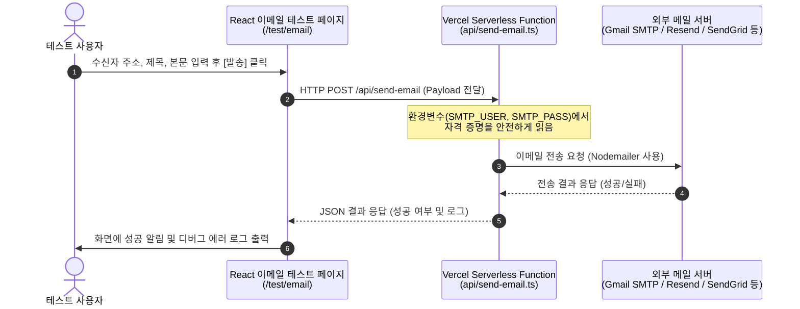

# 이메일 연동 기능 독립 테스트 모듈 구축 방안

현재 개발 중인 전자결재시스템(WorkFit Office)의 핵심 로직 및 데이터베이스에 영향을 주지 않으면서 이메일 연동 기능을 안전하게 테스트하기 위한 아키텍처 및 구현 방안입니다.

---

## 1. 현재 개발 환경 진단 및 아키텍처 제안

### 🔍 개발 환경 진단
* **프론트엔드**: Vite + React + TypeScript 기반의 Single Page Application (SPA).
* **백엔드**: Firebase Client SDK를 통해 데이터베이스(Firestore) 및 인증(Auth)을 직접 호출하는 **서버리스(Serverless)** 구조.
* **호스팅/배포**: `vercel.json` 설정이 포함된 **Vercel** 환경.
* **특징**: 기존에 별도의 Node.js Express 또는 Java Spring Boot 백엔드 서버가 존재하지 않으므로, 이메일 발송에 필요한 SMTP 패스워드나 API Key 같은 **비밀 서명(Credentials)**을 프론트엔드 클라이언트 코드에 직접 노출하면 보안상 심각한 문제가 발생할 수 있습니다.

### 💡 가장 적합한 아키텍처: Vercel Serverless Functions 기반 격리 설계
기존 시스템(Vite SPA + Firebase)에 최소한의 영향만 주며, 보안 문제를 완전히 피하면서 격리된 테스트를 수행하기 위해 **Vercel Serverless Functions(Node.js/API 엔드포인트)**를 활용한 구현 방안을 권장합니다.



---

## 2. 격리 테스트를 위한 구현 가이드

이 방안은 프론트엔드 React 소스 내부의 비즈니스 로직 및 Firestore 트랜잭션과 **완전히 분리**되어 동작합니다.

### 디렉터리 구성 및 역할
```text
workfit-office/
├── api/                       # Vercel Serverless Function 폴더
│   └── send-email.ts          # [NEW] 이메일 발송 API 백엔드 엔드포인트
├── src/
│   ├── app/
│   │   └── App.tsx            # [MODIFY] 테스트 화면 라우트 등록
│   └── modules/
│     └── test/
│         └── EmailTestScreen.tsx # [NEW] 이메일 테스트 UI 페이지
├── .env.local                 # [MODIFY] SMTP/API 키 로컬 환경변수 추가
└── package.json               # [MODIFY] 이메일 발송용 nodemailer 라이브러리 추가
```

---

## 3. 상세 샘플 코드

### ① 백엔드 API 구현 (`api/send-email.ts`)
Vercel은 프로젝트 루트의 `/api` 디렉터리 아래에 위치한 파일을 자동으로 서버리스 API 함수로 빌드합니다. 메일 발송 라이브러리로는 Node.js에서 가장 표준적이고 가벼운 `nodemailer`를 사용합니다.

*(※ 로컬 테스트를 위해 `npm install nodemailer @types/nodemailer` 설치가 필요합니다.)*

```typescript
// api/send-email.ts
import type { VercelRequest, VercelResponse } from '@vercel/node';
import nodemailer from 'nodemailer';

export default async function handler(req: VercelRequest, res: VercelResponse) {
  // CORS 및 POST 메서드 검증
  if (req.method !== 'POST') {
    return res.status(405).json({ success: false, error: 'Method Not Allowed' });
  }

  const { to, subject, html } = req.body;

  if (!to || !subject || !html) {
    return res.status(400).json({ success: false, error: 'Missing required fields (to, subject, html)' });
  }

  try {
    // 1. 전송 도구(Transporter) 구성 - Gmail SMTP 예시
    // 안전한 테스트를 위해 환경변수(Vercel 환경설정 또는 .env.local)를 조회합니다.
    const transporter = nodemailer.createTransport({
      service: 'gmail',
      auth: {
        user: process.env.SMTP_USER, // 발송 Gmail 계정
        pass: process.env.SMTP_PASS, // Gmail 앱 비밀번호 (2단계 인증 필요)
      },
    });

    // 2. 메일 전송 정보 구성
    const mailOptions = {
      from: `"WorkFit 테스트 발신자" <${process.env.SMTP_USER}>`,
      to,
      subject: `[WorkFit Test] ${subject}`,
      html: `
        <div style="font-family: Arial, sans-serif; padding: 20px; border: 1px solid #ddd; border-radius: 8px;">
          <h2 style="color: #2563eb;">WorkFit 이메일 연동 테스트 메일</h2>
          <hr/>
          <div style="margin-top: 15px;">
            ${html}
          </div>
          <hr style="margin-top: 20px; border: 0; border-top: 1px solid #eee;" />
          <p style="font-size: 11px; color: #888;">본 메일은 핵심 로직과 격리된 독립 테스트 모듈을 통해 발송되었습니다.</p>
        </div>
      `,
    };

    // 3. 발송 및 응답 반환
    const info = await transporter.sendMail(mailOptions);
    
    return res.status(200).json({
      success: true,
      messageId: info.messageId,
      response: info.response
    });
  } catch (error: any) {
    console.error('Email Send Error:', error);
    return res.status(500).json({
      success: false,
      error: error.message || 'Unknown Email Error',
      stack: process.env.NODE_ENV === 'development' ? error.stack : undefined
    });
  }
}
```

---

### ② 프론트엔드 React UI 구현 (`src/modules/test/EmailTestScreen.tsx`)
수신처와 내용을 입력하고 전송 결과를 화면에서 디버깅 로그 형태로 즉시 볼 수 있는 전용 테스트 컴포넌트입니다.

```tsx
// src/modules/test/EmailTestScreen.tsx
import React, { useState } from 'react';

export default function EmailTestScreen() {
  const [to, setTo] = useState('');
  const [subject, setSubject] = useState('');
  const [content, setContent] = useState('');
  const [loading, setLoading] = useState(false);
  const [result, setResult] = useState<{ success: boolean; data?: any; error?: string } | null>(null);

  const handleSend = async (e: React.FormEvent) => {
    e.preventDefault();
    setLoading(true);
    setResult(null);

    try {
      const response = await fetch('/api/send-email', {
        method: 'POST',
        headers: { 'Content-Type': 'application/json' },
        body: JSON.stringify({
          to,
          subject,
          html: `<p>${content.replace(/\n/g, '<br/>')}</p>`
        }),
      });

      const data = await response.json();
      if (response.ok && data.success) {
        setResult({ success: true, data });
      } else {
        setResult({ success: false, error: data.error || '발송 실패' });
      }
    } catch (err: any) {
      setResult({ success: false, error: err.message || '네트워크 오류 발생' });
    } finally {
      setLoading(false);
    }
  };

  return (
    <div style={{ maxWidth: '600px', margin: '40px auto', padding: '24px', border: '1px solid #e2e8f0', borderRadius: '12px', fontFamily: 'sans-serif' }}>
      <h2 style={{ fontSize: '20px', fontWeight: 'bold', color: '#1e293b', marginBottom: '8px' }}>📬 이메일 발송 격리 테스트</h2>
      <p style={{ fontSize: '13px', color: '#64748b', marginBottom: '24px' }}>
        시스템 트랜잭션에 영향을 주지 않고 안전하게 이메일 전송 인프라(SMTP)를 검증합니다.
      </p>

      <form onSubmit={handleSend} style={{ display: 'flex', flexDirection: 'column', gap: '16px' }}>
        <div>
          <label style={{ display: 'block', fontSize: '14px', fontWeight: 500, color: '#334155', marginBottom: '4px' }}>수신자 주소 (To)</label>
          <input
            type="email"
            required
            value={to}
            onChange={(e) => setTo(e.target.value)}
            placeholder="example@domain.com"
            style={{ width: '100%', padding: '8px 12px', border: '1px solid #cbd5e1', borderRadius: '6px', fontSize: '14px' }}
          />
        </div>

        <div>
          <label style={{ display: 'block', fontSize: '14px', fontWeight: 500, color: '#334155', marginBottom: '4px' }}>메일 제목 (Subject)</label>
          <input
            type="text"
            required
            value={subject}
            onChange={(e) => setSubject(e.target.value)}
            placeholder="테스트 메일 제목입니다"
            style={{ width: '100%', padding: '8px 12px', border: '1px solid #cbd5e1', borderRadius: '6px', fontSize: '14px' }}
          />
        </div>

        <div>
          <label style={{ display: 'block', fontSize: '14px', fontWeight: 500, color: '#334155', marginBottom: '4px' }}>메일 본문 (Content)</label>
          <textarea
            required
            rows={5}
            value={content}
            onChange={(e) => setContent(e.target.value)}
            placeholder="여기에 메일 내용을 입력하세요..."
            style={{ width: '100%', padding: '8px 12px', border: '1px solid #cbd5e1', borderRadius: '6px', fontSize: '14px', resize: 'vertical' }}
          />
        </div>

        <button
          type="submit"
          disabled={loading}
          style={{
            backgroundColor: loading ? '#94a3b8' : '#2563eb',
            color: 'white',
            padding: '10px 16px',
            border: 'none',
            borderRadius: '6px',
            cursor: loading ? 'not-allowed' : 'pointer',
            fontSize: '14px',
            fontWeight: 600,
            transition: 'background-color 0.2s'
          }}
        >
          {loading ? '전송 중...' : '이메일 발송'}
        </button>
      </form>

      {/* 결과 디버그 패널 */}
      {result && (
        <div style={{ marginTop: '24px', padding: '16px', borderRadius: '8px', border: '1px solid', borderColor: result.success ? '#bbf7d0' : '#fecaca', backgroundColor: result.success ? '#f0fdf4' : '#fef2f2' }}>
          <h4 style={{ margin: 0, fontSize: '14px', color: result.success ? '#166534' : '#991b1b', fontWeight: 600 }}>
            {result.success ? '✔ 전송 성공' : '❌ 전송 실패'}
          </h4>
          <pre style={{ margin: '8px 0 0 0', padding: '8px', backgroundColor: '#1e293b', color: '#f8fafc', borderRadius: '4px', fontSize: '12px', overflowX: 'auto', fontFamily: 'monospace' }}>
            {JSON.stringify(result.success ? result.data : result.error, null, 2)}
          </pre>
        </div>
      )}
    </div>
  );
}
```

### ③ 로컬 환경 변수 설정 (`.env.local`)
개발 환경에서 자격증명을 안전하게 처리하기 위해 환경변수를 정의합니다.

```env
# .env.local (로컬 전용 - gitignore 처리됨)
SMTP_USER="본인의_gmail_주소@gmail.com"
SMTP_PASS="발급받은_구글_앱_비밀번호"
```

---

## 4. 제안 요약 및 검증 시 기대 효과

1. **보안성**: 메일 서버의 접속 비밀번호나 토큰이 브라우저 클라이언트 소스코드에 전혀 드러나지 않고 Vercel의 Serverless Backend 단에서만 안전하게 동작합니다.
2. **시스템 영향 제로**: 기존 React의 비즈니스 훅, API 로직 및 Firebase 데이터 저장 경로에 일절 간섭하지 않고 독립적으로 기능합니다.
3. **용이한 진단**: 성공 및 실패 응답 객체를 원시 JSON 상태 그대로 프론트엔드 에러 패널에 출력하여 인프라 연동 트러블슈팅 시간을 대폭 단축할 수 있습니다.
