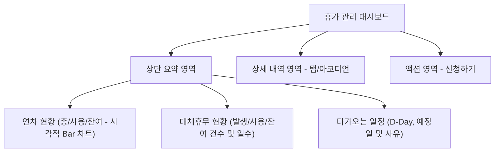

# 📅 휴가 관리 시스템 및 휴가원 양식 잔여 휴가 연동 구현 계획

본 문서는 사용자가 본인의 휴가 현황을 한눈에 파악하고, 휴가 신청서 작성 시 잔여 휴가 정보를 실시간으로 확인 및 검증할 수 있도록 돕는 **휴가 관리 대시보드**와 **휴가원 양식 연동** 기능에 대한 구상 및 설계안입니다.

---

## 💡 1. 기본 방향 및 핵심 원칙
*   **통합 조회, 명확한 구분**: 연차와 대체휴무는 성격과 소멸 조건이 다르므로 화면상 구분하여 표시하되, 사용자가 한 페이지에서 전체 가용 휴가를 직관적으로 볼 수 있도록 대시보드를 구성합니다.
*   **실시간 잔여 일수 연동**: 휴가 신청 양식에서 '휴가 구분'을 선택하는 즉시 실시간으로 해당 구분의 잔여 일수를 표시하고 검증합니다.
*   **데이터 검증(Validation)**: 잔여 휴가를 초과하여 신청하는 경우 결재 상신을 제한하여 반려 프로세스를 사전에 차단합니다.

---

## 🎨 2. 휴가 관리 페이지 (대시보드 UI/UX) 구성안

### A. 상단 요약 영역 (Summary Bar)
최상단에 가장 핵심적인 정보인 **잔여 휴가 현황**을 시각적인 요소와 함께 배치합니다.



1.  **연차 현황 카드**
    *   총 발생 연차, 사용 연차, 잔여 연차 표시
    *   **비주얼 요소**: 잔여/사용 비율을 보여주는 프로그레스 바(Progress Bar) 또는 도넛 차트
2.  **대체휴무 현황 카드**
    *   총 발생 일수, 소진 일수, 잔여 대체휴무 일수 표시
    *   유효기간(소멸 예정)이 임박한 대체휴무 건수에 대한 경고 알림(e.g., "1개월 내 소멸 예정 1건")
3.  **다가오는 일정 카드**
    *   가장 가까운 예정 휴가일, D-Day, 휴가 사유 표시

### B. 상세 내역 영역 (Tabs / Accordion)
하단에는 세부적인 이력을 조회할 수 있는 탭 인터페이스를 제공합니다.

| 탭 이름 | 주요 표시 내용 | 기능 특징 |
| :--- | :--- | :--- |
| **연차 내역** | 연도별 발생/소진 내역 테이블 | 입사일 기준 자동 계산 데이터 매핑 |
| **대체휴무 내역** | 발생 사유(프로젝트명/업무명), 발생일, 소진일, 만료 예정일 | 유효기간 초과 시 '만료 소멸' 상태 표시 |
| **휴가 신청 이력** | 결재 문서 번호, 신청일, 휴가 기간, 결재 상태 | 상태값(결재대기/진행중/완료/반려) 필터링 기능 |

### C. 액션 영역
*   **[휴가 신청하기]** 버튼 배치: 클릭 시 전자결재 내 '휴가원 양식' 작성 화면으로 바로 이동하며, 대시보드의 잔여 휴가 데이터를 폼 내에 자동으로 연동합니다.

---

## 📝 3. 휴가 신청서 (휴가원 양식) 연동 및 검증 설계

휴가 신청서 양식 내에서 사용자가 휴가를 올바르게 신청할 수 있도록 동적 UI와 유효성 검사 로직을 추가합니다.

### 3.1 신청서 내 잔여 휴가 동적 표시
*   **휴가 종류 선택 (드롭다운)**: 연차, 오전반차, 오후반차, 대체휴무, 특별휴가 등
*   **잔여일수 실시간 노출**:
    *   **연차/반차 선택 시**: `"연차 잔여: 12.5일"` 표시
    *   **대체휴무 선택 시**: `"대체휴무 잔여: 2.0일 (유효기간 내 사용 가능분)"` 표시
    *   **특별휴가 선택 시**: 잔여일수 제한 없음 또는 별도 기준 표시

### 3.2 유효성 검사 (Validation) 및 상신 제어
```javascript
// 유효성 검사 및 결재 상신 버튼 활성화 예시 로직
function validateVacationRequest(requestType, requestDays, balances) {
  let remainingDays = 0;
  
  if (requestType === 'ANNUAL_LEAVE') {
    remainingDays = balances.annualLeave.remaining;
  } else if (requestType === 'SUBSTITUTE_HOLIDAY') {
    remainingDays = balances.substituteHoliday.remaining;
  } else {
    return { isValid: true }; // 기타 휴가는 별도 규칙 적용
  }

  if (requestDays > remainingDays) {
    return {
      isValid: false,
      message: `잔여 휴가 일수(${remainingDays}일)를 초과하여 신청할 수 없습니다.`
    };
  }
  
  return { isValid: true };
}
```

### 3.3 대체휴무 발생 (연장근로 신청서 연동) 및 소진 규칙

대체휴무의 오남용을 방지하고 데이터의 무결성을 유지하기 위해 **연장근로(휴일근무) 신청서**의 최종 결재 승인 및 근무 결과와 연동하여 대체휴무 일수를 자동 산정하고 적재합니다.

#### A. 대체휴무 발생 사규 예시 (산정 기준)
*   **보상 선택제**: 연장근로 또는 휴일근무 신청서 작성 시, 신청자는 **[수당 지급]**과 **[대체휴무 부여]** 중 하나를 선택하여 신청해야 합니다.
*   **대체휴무 적립 기준**:
    *   휴일/연장 실근무 시간이 **4시간 이상 8시간 미만**인 경우: **0.5일** 부여
    *   휴일/연장 실근무 시간이 **8시간 이상**인 경우: **1.0일** 부여
*   **유효기간 및 소멸**: 대체휴무는 발생일(실제 근무일)로부터 **3개월(90일)** 동안 유효하며, 해당 기간 내에 사용하지 않은 대체휴무는 자동으로 소멸됩니다.

#### B. 시스템 처리 프로세스 (Lifecycle)
1.  **발생 (연장근로 연동)**: 
    *   [연장/휴일근로 신청서] 최종 결재 완료 및 출퇴근 기록 매칭 검증
    *   대체휴무 대상 건인 경우, 근무 시간 기준(0.5일/1.0일) 및 유효기간(근무일 + 3개월)을 계산하여 대체휴무 마스터 테이블에 자동으로 신규 적재
2.  **소진 (휴가원 연동)**:
    *   [휴가 신청서(휴가원)] 결재 완료 시, **만료일자가 가장 임박한 미사용 대체휴무 건부터 차례대로 소진(선입선출, FIFO)** 처리
3.  **수동 조정 (인사 어드민)**:
    *   회사 포상 휴가나 특이 케이스 처리를 위해 인사담당자가 관리자 화면에서 대체휴무를 강제로 추가하거나 차감할 수 있는 수동 조절 기능 지원

---

> [!IMPORTANT]
> **대체휴무 만료 필터링**
> 대체휴무는 발생일로부터 3개월 내에 사용하지 않으면 소멸됩니다. 따라서 신청서 연동 시 **신청하고자 하는 휴가 예정일 기준**으로 유효한 대체휴무 잔여분만 계산하여 유효성 검사를 수행해야 합니다.

---

## 🗄️ 4. 데이터 모델 (Schema) 설계 제안

### 4.1 휴가 잔여 현황 API 응답 스키마 (`GET /api/vacation/balance`)
```json
{
  "userId": "emp-1024",
  "userName": "홍길동",
  "annualLeave": {
    "total": 15.0,
    "used": 4.5,
    "remaining": 10.5
  },
  "substituteHoliday": {
    "total": 5.0,
    "used": 2.0,
    "remaining": 3.0,
    "expiringSoonCount": 1, 
    "detailList": [
      {
        "id": "sub-001",
        "occurrenceDate": "2026-05-10",
        "expirationDate": "2026-08-09",
        "reason": "주말 시스템 마이그레이션 작업 지원",
        "days": 1.0,
        "used": 1.0,
        "status": "USED"
      },
      {
        "id": "sub-002",
        "occurrenceDate": "2026-07-01",
        "expirationDate": "2026-10-01",
        "reason": "ERP 구축 프로젝트 야간 장애 대응",
        "days": 2.0,
        "used": 0.0,
        "status": "AVAILABLE"
      }
    ]
  }
}
```

---

## 🚀 5. 향후 단계별 구현 계획

1.  **Backend API 개발 및 데이터 연동**
    *   사원별 입사일 기준 연차 자동 계산 스케줄러/유틸리티 검증
    *   근무 기록(대체휴무 발생 조건)과 연동된 대체휴무 테이블 적재 로직 구축
2.  **대시보드 Frontend UI 구현**
    *   `src/pages/VacationDashboard.tsx` 신규 컴포넌트 작성
    *   상단 요약 바 차트 컴포넌트(Tailwind CSS 또는 SVG 기반 Progress Bar) 추가
3.  **결재서식(휴가원) 내 잔여휴가 동적 렌더링**
    *   `src/components/approval/forms/VacationRequestForm.tsx` (또는 해당 양식 렌더러)에 드롭다운 및 잔여 정보 표시 영역 추가
    *   양식 제출(결재 요청) 시 프론트엔드 및 백엔드 더중 유효성 검사 적용
